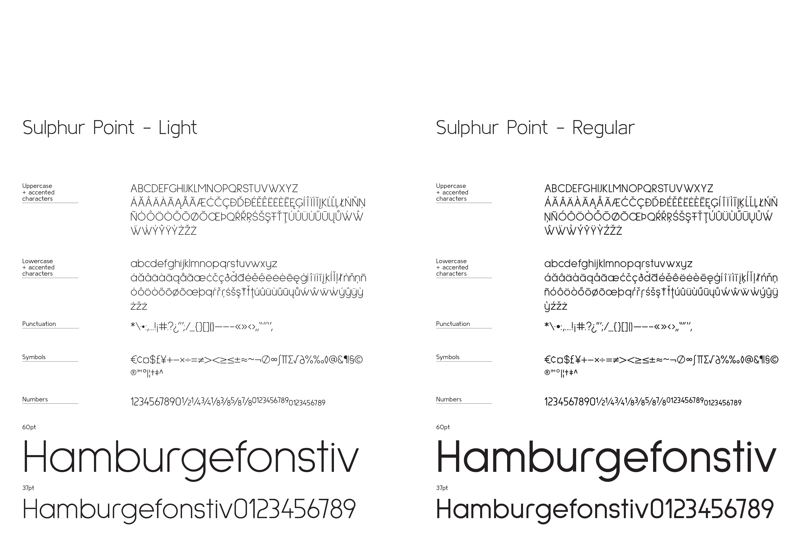
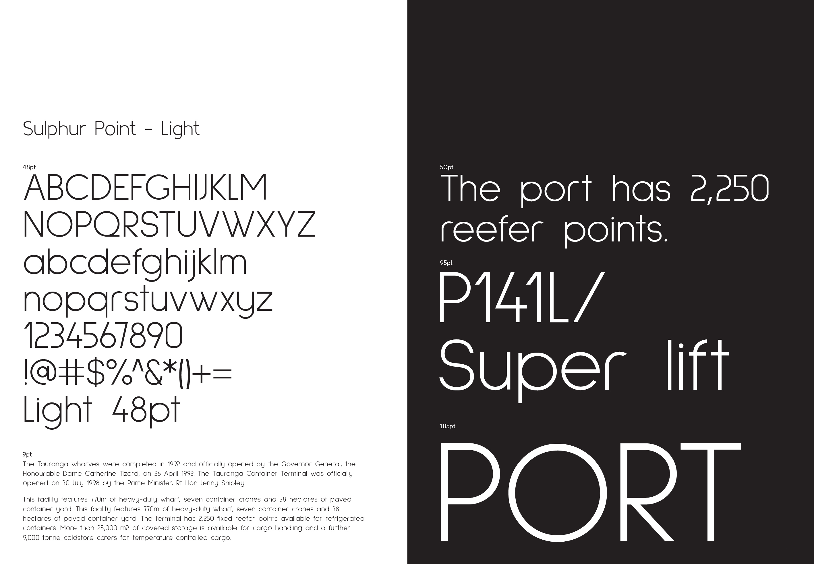
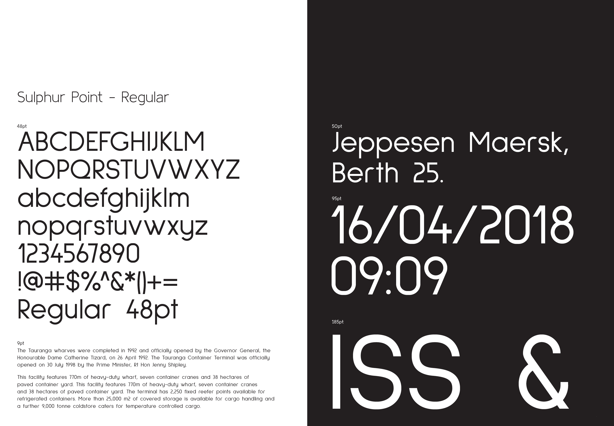
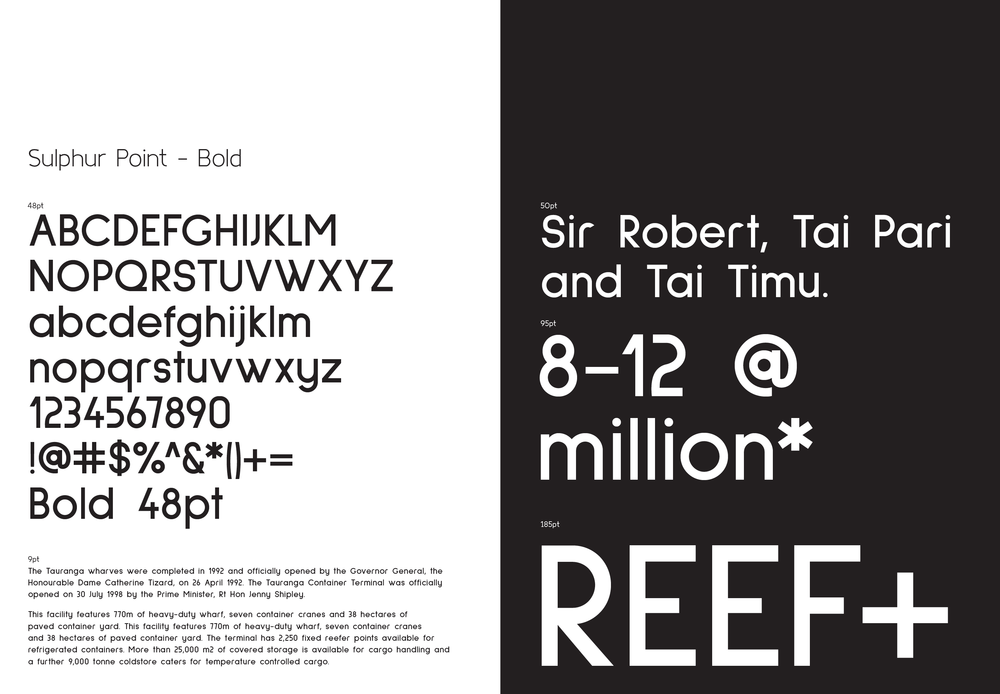
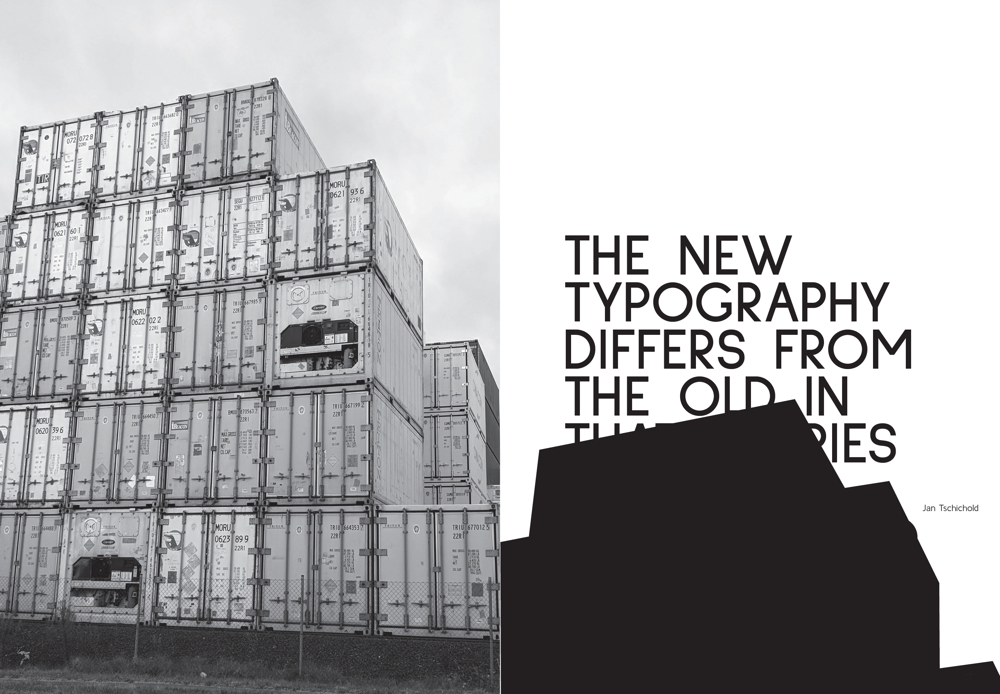
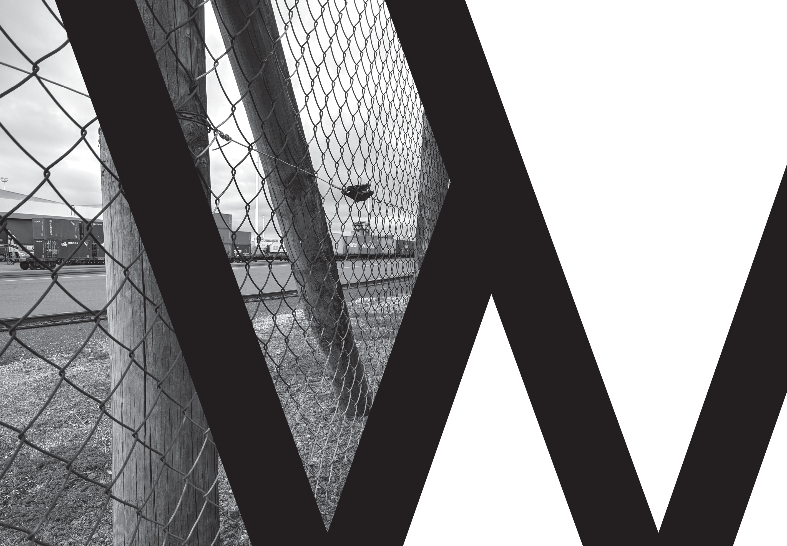

# Sulphur Point

Sulphur Point is a geometric sans serif typeface, with a low contrast stems, high x-height, restrained ascenders and descenders and minimal optical adjustments away from pure geometric form. Sulphur Point is intended for both display and copy use.

The typeface is the result of an exploration of theories of the political production of space as manifested in the port and recreational marine facilities of Sulphur Point here in Tauranga, New Zealand.

### Project documentation
Sulphur Point is part of a larger series of site specific typefaces completed as part of a masters project. Further details regarding this typefaces development are available here, [Project overview](docs/project-overview.md).

### Available weights
Light   
Regular  
Bold   

